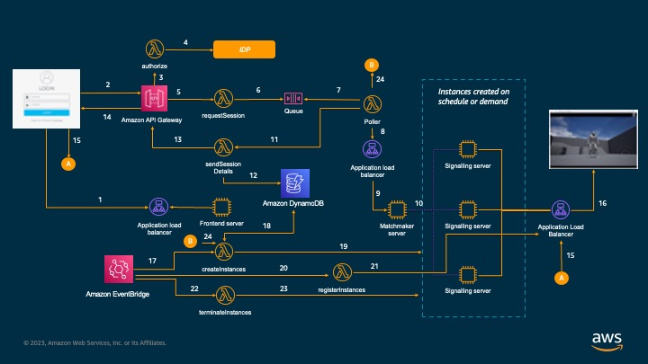

## Deploying Unreal Engine on AWS at scale ##

This repository provides a reference framework to deploy Pixel Streaming on Unreal Engine at scale and manage streaming sessions across multiple instances of signalling servers. The repository is based on the 5.2 version of Unreal Engine's Pixel Streaming infrastructure which can be found in this [link](https://github.com/EpicGames/PixelStreamingInfrastructure/tree/UE5.2)
 

## Solution Architecture ##

## Dependecies ##

1. You have a functional Unreal Engine application configured with Pixel Streaming.
2. You have an AWS account which administrative privileges.
3. The [SignallingWebServer](SignallingWebServer) and  [Matchmaker](Matchmaker) repositories only contain the files that have been changed to support this framework. For deploying them, you would need to merge the changes with the existing files in Unreal Engine's Pixel Streaming [repository](https://github.com/EpicGames/PixelStreamingInfrastructure/tree/UE5.2)
4. Security group for SignallingWebServer may need additional routes depending on your setup. Please update the same in [create.yml](infra/create.yaml).

## Deploying the framework ##

1. The Pixel Streaming Infrastructure contains reference implementations for all the components needed to run a pixel streaming application. Deploy [SignallingWebServer](SignallingWebServer) and  [Matchmaker](Matchmaker) applications on EC2 instances of their own and [create an AMI.](https://docs.aws.amazon.com/toolkit-for-visual-studio/latest/user-guide/tkv-create-ami-from-instance.html) . For steps associated with deploymenty,refer  [documentation](https://github.com/EpicGames/PixelStreamingInfrastructure/blob/UE5.2/README.md).  
2. Create and EC2 instance and clone the [Frontend](Frontend) repository. Register the application as a service, running on port 8080. Once completed, please use directions from step #1 to create an AMI
3. At this step, you should have 3 AMI - SignallingWebServer, Matchmaker and Frontend applications.
4. Please upload the  script [create.yml](infra/create.yaml) to cloudformation and provide the AMIs' created as input. The script would create the required infrastructure as per the solution diagram
4. Please replace the code of the lambda functions created with the code defined in [Lambda](Lambda/)
6. Please connect to the Frontend server and navigate to '/usr/customapps/pixelstreaming/Frontend/implementations/react' .Please switch to 'su' and replace the environment variables in [webpack.dev.js](Frontend/implementations/react/webpack.dev.js) and restart Frontend service.Please ensure that the frontend service shows as 'Running' with no errors
7. Please run the lambda function [uploadToDDB](infra/uploadToDDB) from your AWS console to populate DynamoDB with the required information

## Getting started ##

Please retrieve the Cognito application endpoint URL from within Cognito. Below are the steps to retrieve the same
- Go to the Amazon Cognito console
- Choose User Pool 
- Choose the existing user pool from the list - ueauthenticationpool
- Select the App integration tab.
- Select the existing app client from the app client list
- Click on the 'View Hosted UI' button to get started

Please sign up with a new user .[Here](https://docs.aws.amazon.com/cognito/latest/developerguide/cognito-user-pools-hosted-ui-user-sign-up.html) are the steps for the same

## Additional Considerations ##

In order for the solution to run end to end, the ALB created for Matchmaker and SignallingWebServer would need to expose https endpoints. Please upload/create required SSL certificates in ACM and link them to the ALB listeners.

## Cleanup ##

To cleanup, please remove the lambda code and then delete the cloudformation stack

## Disclaimer ##

You should not use this AWS Content in your production accounts, or on production or other critical data. You are responsible for testing, securing, and optimizing the AWS Content, 
such as sample code, as appropriate for production grade use based on your specific quality control practices and standards.